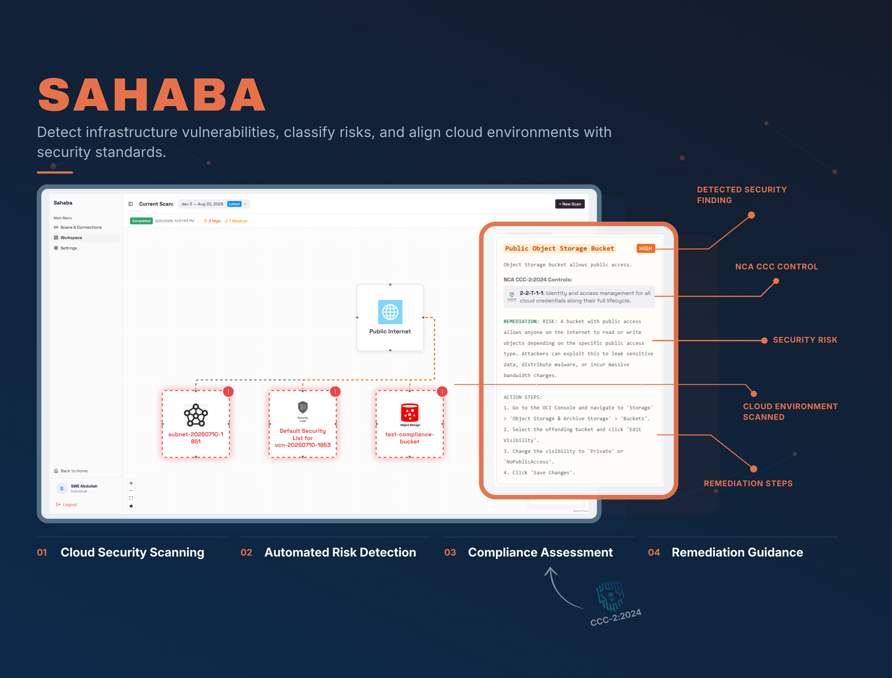
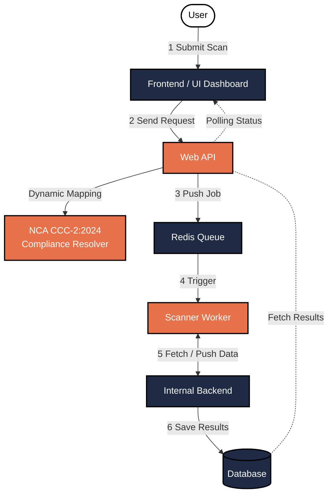
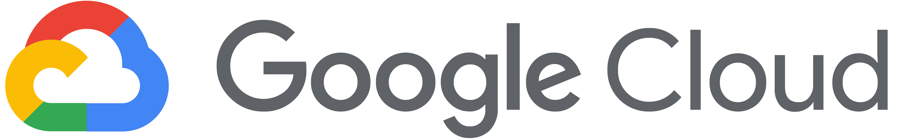

# Sahaba (سحابة) - Cloud Security & Compliance Analyzer
*An automated, multi-cloud Cloud Security Posture Management (CSPM) and compliance analysis platform.*

---

## Preview
<div align="center">
  
</div>

<br />

## Overview

<p align="center">
  
  
  
  
  
</p>

Managing security across multi-cloud environments (AWS, GCP, OCI) introduces critical operational challenges such as cloud misconfigurations, fragmented visibility, delayed detection, and the heavy burden of regulatory compliance.

Sahaba solves this by acting as an automated, non-intrusive, and asynchronous scanning engine. It securely connects to your cloud accounts, retrieves live configurations, and evaluates them against an extensible catalog of security rules. Crucially, Sahaba's compliance resolver dynamically correlates these low-level technical findings with regulatory controls from the **NCA CCC-2:2024** framework, ensuring your infrastructure is both secure and compliant.

## Features
- **Automated Resource Discovery**: Connects securely to cloud accounts and retrieves live configurations across compute, storage, IAM, and networking services.
- **Rule & Scoring Engine**: Evaluates configurations against an extensible catalog of security rules with clear severity levels (`CRITICAL`, `HIGH`, `WARNING`, `MEDIUM`, `INFO`).
- **NCA CCC-2:2024 Compliance Resolver**: Maps technical vulnerabilities directly to specific NCA regulatory controls.
- **Decoupled Asynchronous Workers**: Scraping and processing are handled by background Python daemons via Redis queues, ensuring the UI remains fast.
- **Zero-Trust Network Isolation**: Cloud credentials and scanner workers are secured inside an isolated private Docker network.

## System Architecture



## NCA CCC-2:2024 Compliance Integration

Sahaba includes built-in alignment with the **National Cybersecurity Authority (NCA) Cloud Cybersecurity Controls (CCC-2:2024)**:

- **Automated Control Mapping**: Security checks (e.g., MFA enforcement, encryption in transit/rest, restricted ingress ports) map directly to relevant NCA CCC control clauses.
- **Audit-Ready Posture**: Transforms raw technical findings into standardized compliance indicators, enabling organizations to assess regulatory readiness alongside technical security.
- **Actionable Remediation**: Each finding provides direct, step-by-step remediation instructions aligned with cybersecurity best practices.

## Supported Cloud Providers

<table>
  <thead>
    <tr>
      <th align="center">Provider</th>
      <th align="left">Covered Resource Domains</th>
      <th align="left">Example Security Checks</th>
    </tr>
  </thead>
  <tbody>
    <tr>
      <td align="center">
        <br/>
        <strong>Amazon Web Services</strong>
      </td>
      <td>
        • <strong>Amazon S3</strong> (Object Storage)<br/>
        • <strong>Amazon EC2</strong> (Compute & Security Groups)<br/>
        • <strong>AWS IAM</strong> (Identity & Access Management)
      </td>
      <td>
        • Public S3 bucket ACL & policy audits<br/>
        • Unrestricted SSH (0.0.0.0/0 on port 22)<br/>
        • Root user MFA activation checks
      </td>
    </tr>
    <tr>
      <td align="center">
        <br/>
        <strong>Google Cloud Platform</strong>
      </td>
      <td>
        • <strong>Cloud Storage</strong> (Buckets & IAM)<br/>
        • <strong>Compute Engine</strong> (VM instances)<br/>
        • <strong>VPC Firewall Rules</strong><br/>
        • <strong>Cloud IAM</strong> (Service Accounts)
      </td>
      <td>
        • Publicly readable storage buckets<br/>
        • Overly permissive VPC firewall ingress rules<br/>
        • Compute instances with external public IPs
      </td>
    </tr>
    <tr>
      <td align="center">
        <br/>
        <strong>Oracle Cloud Infrastructure</strong>
      </td>
      <td>
        • <strong>Object Storage</strong><br/>
        • <strong>Core Compute & Networking</strong><br/>
        • <strong>OCI Identity Domains</strong>
      </td>
      <td>
        • Public object storage visibility<br/>
        • Open security lists and network security groups<br/>
        • IAM policy and tenancy security baselines
      </td>
    </tr>
  </tbody>
</table>

## Getting Started

### Prerequisites
- [Docker](https://docs.docker.com/get-docker/) & [Docker Compose](https://docs.docker.com/compose/)
- Git

### 1. Clone & Configure Environment
```bash
git clone https://github.com/vAbdullh/CloudRiskAnalyzer.git
cd CloudRiskAnalyzer

# Copy environment configuration
cp example.env .env
```
*(On Windows PowerShell: `Copy-Item example.env .env`)*

### 2. Launch the Platform
Start the complete containerized stack:
```bash
docker compose up --build -d
```

### Service Ports & Access
Once started, the following services are available locally:

| Service | Port | Description |
| :--- | :--- | :--- |
| **Frontend UI** | `http://localhost:5173` | React Dashboard |
| **Public Web API** | `http://localhost:3000` | REST API & Auth Proxy |
| **GoTrue Auth** | `http://localhost:9999` | Standalone Auth Service |
| **PostgreSQL DB** | `localhost:5432` | Core Application Database |
| **pgAdmin (Optional)** | `http://localhost:5050` | Database Administration UI |

---

## Documentation

Detailed technical specifications, architecture guides, and API references are available in the [`docs/`](./docs) directory:

- [**System Architecture & Network Topology**](./docs/system-architecture.md) — Multi-tier microservices architecture, network boundary definitions, and end-to-end scan lifecycle.
- [**Scanner Subsystem Architecture**](./docs/scanner-architecture.md) — Redis worker daemon execution, standalone CLI mode, provider integration contracts, and results submission.
- [**Public Web API Reference**](./docs/public-api-reference.md) — Complete endpoint reference for user authentication, cloud connection management, and compliance scan results.
- [**Internal Backend Service Reference**](./docs/internal-backend-reference.md) — Private FastAPI service specification, worker authentication, atomic job polling, and rule catalog synchronization.
- [**NCA CCC-2:2024 Compliance Engine**](./docs/nca-ccc-compliance-engine.md) — Decoupled compliance mapping architecture, Annex A classification levels, and dynamic control resolution.
- [**Threat Detection & Rules Catalog**](./docs/threat-detection-catalog.md) — Complete inventory of all 55 active security rules across AWS, GCP, and OCI and 25 standardized finding categories.
- [**Rule Development & Extensibility Guide**](./docs/rule-development-guide.md) — Developer guide for authoring, testing, and registering new security rules using `BaseRule`.

---

## License

This project is licensed under the MIT License - see the [LICENSE](./LICENSE) file for details.
