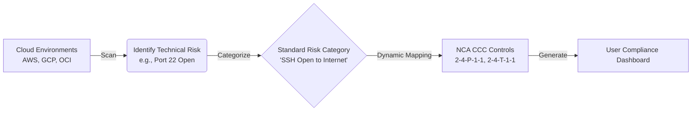

# NCA CCC Compliance Alignment & Strategic Roadmap

## Executive Summary
This report provides an overview of how the CloudRiskAnalyzer (Sahaba) platform maps detected cloud security risks to the National Cybersecurity Authority (NCA) Cloud Computing Controls (CCC). 

Overall, the platform has successfully implemented a dynamic compliance engine capable of translating raw security alerts into standardized NCA CCC compliance reports in real-time. However, our current detection capabilities (the scanner rules) do not yet cover all the compliance categories we have defined, leaving us with blind spots in our compliance posture. Additionally, a few operational bottlenecks pose a risk to system stability and data accuracy.

## How Our Compliance Engine Works
Our system is designed to seamlessly bridge the gap between technical cloud configurations and regulatory compliance requirements. 

1. **Continuous Scanning:** The system continuously monitors cloud environments (AWS, GCP, OCI) for security misconfigurations.
2. **Standardization:** When a risk is found, it is categorized into a standardized "Risk Category" (e.g., *Publicly Accessible Storage*).
3. **Dynamic Resolution:** When a user requests a compliance report, our API dynamically links these Risk Categories to the specific NCA CCC controls they violate, adjusting for the user's specific data classification level and role (Cloud Service Provider vs. Tenant).

## Current Compliance Coverage
Our system currently detects and maps risks across several critical security domains. 

| Security Domain | What We Detect | NCA CCC Domains Covered |
| :--- | :--- | :--- |
| **Network Security** | Unauthorized open ports (SSH/RDP), overly permissive firewalls, and misconfigured security groups. | 2-4 (Network Security) |
| **Identity & Access Management** | Direct root account usage, missing MFA on privileged accounts, overly permissive policies, and weak password requirements. | 2-2 (Identity and Access Management) |
| **Data & Storage Security** | Publicly readable storage buckets, unencrypted data at rest, missing backups, and disabled logging. | 2-3 (InfoSys Protection), 2-6 (Data Protection), 2-7 (Cryptography), 2-8 (Backup), 2-11 (Logging) |
| **Vulnerability Management** | Unpatched infrastructure and non-terminable remote access. | 2-9 (Vulnerability Management) |

## Compliance Gaps & Business Risks

### 1. Detection Blind Spots (Unmapped Controls)
While our system knows *how* to map certain risks to NCA CCC, our scanners currently lack the ability to detect them in the first place. This creates a false sense of security for users expecting comprehensive compliance monitoring. 
**Key Missing Detection Capabilities:**
* Data in transit encryption failures
* Missing Web Application Firewalls (WAF)
* Hardcoded credentials in configurations
* Lack of key rotation
* Unrestricted or unencrypted backups

### 2. Accuracy Risks
A few of our current detection rules are mapped to broad or inaccurate categories. For example, detecting "Too Many Inbound Firewall Rules" is currently mapped to the same critical compliance failure as "Allowing All Inbound Traffic." This can lead to inaccurate compliance scoring and false positives for our users.

### 3. Operational & Stability Risks
* **Deployment Fragility:** The compliance mapping component relies on hardcoded server configurations. If deployed to a new environment without identical directory structures, the compliance reporting feature will fail completely.
* **Silent Failures:** If the system encounters an unknown risk rule, or if the scanning queue experiences a hiccup, it currently fails silently or drops data without notifying the user or the operations team. This risks data integrity and user trust.

## Strategic Recommendations

To mature our compliance offering and ensure enterprise readiness, we recommend the following priorities for the engineering and product teams:

1. **Expand Scanner Coverage (Product Roadmap):** Prioritize writing new scanner rules to cover the critical blind spots identified above, particularly around data-in-transit, WAF configurations, and credential management.
2. **Refine Mapping Accuracy (Quality Assurance):** Review and correct the mappings for specific network rules (like SEC-011 and SEC-013) to ensure our compliance dashboards accurately reflect the true nature of the risk.
3. **Enhance System Resilience (Engineering Priority):** Address the deployment fragilities and silent failure bugs immediately. Ensure that the system gracefully handles unrecognized rules and alerts the operations team when scan jobs fail, guaranteeing data reliability for our clients.
4. **Enrich Compliance Reporting (UX/UI):** The current data passed to the frontend lacks contextual details (like specific NCA domains and subdomains). Enriching this data will allow us to build more detailed, categorized compliance reports for our users without complex frontend workarounds.
