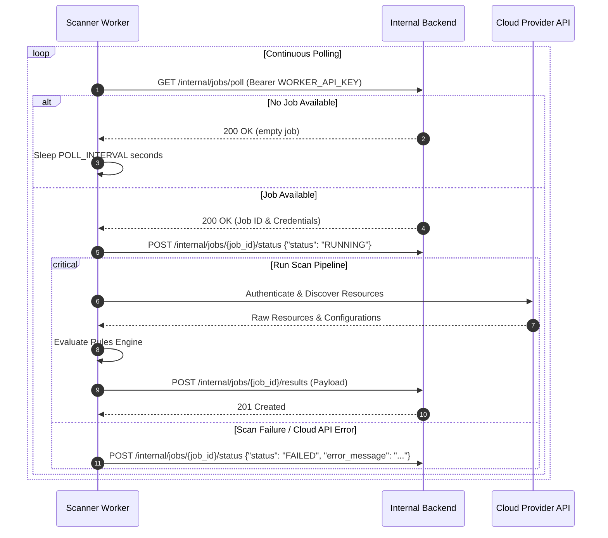

# Scanner Worker Service Design

## 1. Overview

The Scanner Worker is a private microservice/daemon responsible for executing cloud security audits headlessly without user intervention.

It communicates exclusively with the **Internal Backend Service** over a private Docker network to pull pending scan jobs, obtain credentials, perform multi-cloud resource discovery and security rule evaluations, and submit scan findings back to the platform.

### Responsibilities:
- Poll or fetch scan jobs from Internal Backend Service (`/internal/jobs/poll`).
- Authenticate requests using `Authorization: Bearer WORKER_API_KEY`.
- Parse cloud provider credentials dynamically (AWS, OCI, GCP) without reading from interactive console (`input()`) or local files.
- Execute cloud API calls to discover resources and collect configurations.
- Run rule evaluations against collected resource configurations.
- Normalize resources and findings into unified payload structures matching the backend database schema.
- Submit final findings and update scan job status (`RUNNING`, `COMPLETED`, `FAILED`) via Internal Backend API.

---

## 2. Architecture & System Flow

```text
+-----------------------------------------------------------------------------------+
|                                  PRIVATE NETWORK                                  |
|                                                                                   |
|  +---------------------------+                +--------------------------------+  |
|  |                           |  1. Poll Job   |                                |  |
|  |                           | -------------> |                                |  |
|  |                           |  2. Job & Keys |                                |  |
|  |                           | <------------- |                                |  |
|  |                           |                |                                |  |
|  |      Scanner Worker       |  3. Status     |        Internal Backend        |  |
|  |     (Python Daemon)       | -------------> |            Service             |  |
|  |                           |   ("RUNNING")  |      (Express / FastAPI)       |  |
|  |                           |                |                                |  |
|  |                           |  4. Results    |                                |  |
|  |                           | -------------> |                                |  |
|  +---------------------------+                +--------------------------------+  |
|               |                                                                   |
+---------------+-------------------------------------------------------------------+
                |
                | Cloud API Calls
                v
  +---------------------------+
  |    AWS / OCI / GCP APIs   |
  +---------------------------+
```

---

## 3. Technology Stack & Directory Structure

- **Language**: Python 3.11+
- **HTTP Client**: `requests` / `httpx` (for REST communication with Internal Backend)
- **Cloud SDKs**: `boto3` (AWS), `oci` (Oracle Cloud), `google-cloud-*` (GCP)
- **Validation**: `pydantic` (for input/output schema enforcement)

### Directory Layout
```text
scanner/
├── worker.py              # Main polling daemon loop
├── runner.py              # Headless scan executor logic
├── api_client.py          # HTTP client for Internal Backend (/internal/jobs/*)
├── requirements.txt       # Dependencies (requests, boto3, oci, etc.)
├── providers/
│   ├── base.py            # Base provider interface
│   ├── aws.py             # AWS provider (boto3)
│   ├── gcp.py             # GCP provider
│   └── orc.py             # OCI provider
└── rules/
    ├── executor.py        # Rule evaluation engine
    ├── aws/               # AWS rules (EC2, S3, IAM)
    ├── gcp/               # GCP rules
    └── oci/               # OCI rules
```

---

## 4. Internal API Client Specifications (`api_client.py`)

The scanner worker interacts with the Internal Backend using HTTP requests authenticated with a shared secret:

Header: `Authorization: Bearer <WORKER_API_KEY>`

### Endpoints Used by Worker:

1. **Poll Job**: `GET /internal/jobs/poll`
   - Returns next `PENDING` scan job and decrypted credentials, or `200 OK` with null payload if no jobs are available.

2. **Update Status**: `POST /internal/jobs/{job_id}/status`
   - Payload: `{"status": "RUNNING"}` or `{"status": "FAILED", "error_message": "..."}`

3. **Submit Results**: `POST /internal/jobs/{job_id}/results`
   - Submits normalized resources, rules catalog, and evaluation findings.

---

## 5. Unified Data Schemas (JSON Payloads)

### 5.1 Job Payload (Received from `/internal/jobs/poll`)
```json
{
  "job_id": "c1f7a90b-3d4e-5f6a-7b8c-9d0e1f2a3b4c",
  "connection_id": "a0b1c2d3-e4f5-6a7b-8c9d-0e1f2a3b4c5d",
  "provider": "aws",
  "credentials": {
    "aws_access_key_id": "AKIA...",
    "aws_secret_access_key": "...",
    "region_name": "us-east-1"
  }
}
```

### 5.2 Results Payload (Sent to `/internal/jobs/{job_id}/results`)
```json
{
  "job_id": "c1f7a90b-3d4e-5f6a-7b8c-9d0e1f2a3b4c",
  "resources": [
    {
      "provider_resource_id": "i-0123456789abcdef0",
      "resource_type": "EC2",
      "name": "web-server-1",
      "region": "us-east-1",
      "configuration": {
        "instance_id": "i-0123456789abcdef0",
        "public_ip": "54.210.10.5",
        "security_groups": ["sg-012345"]
      }
    }
  ],
  "rules": [
    {
      "id": "SEC-001",
      "provider": "aws",
      "name": "Open SSH Port",
      "severity": "CRITICAL",
      "description": "Security group allows SSH (port 22) from anywhere (0.0.0.0/0)",
      "recommendation": "Restrict SSH access to trusted IP addresses only."
    }
  ],
  "findings": [
    {
      "provider_resource_id": "i-0123456789abcdef0",
      "rule_id": "SEC-001",
      "status": "FAIL",
      "details": {
        "severity": "CRITICAL",
        "recommendation": "Restrict SSH access to trusted IP addresses only."
      }
    }
  ]
}
```

---

## 6. Worker Execution Lifecycle (`worker.py`)



---

## 7. Implementation Plan & Milestones

### Milestone 1: Internal API Client (`scanner/api_client.py`)
- Implement `InternalBackendClient` class with base URL, authentication headers, error logging, and retry logic.
- Implement methods: `poll_job()`, `update_status(job_id, status, error=None)`, `submit_results(job_id, results_payload)`.

### Milestone 2: Provider & Scanner Refactoring (`scanner/runner.py`)
- Remove interactive prompts (`input()`) from `scanner/main.py`.
- Refactor `runner.py` to accept in-memory credential dictionaries and run non-interactively.
- Unify output structures for AWS, OCI, and GCP resources.

### Milestone 3: Worker Polling Daemon (`scanner/worker.py`)
- Build continuous loop checking `/internal/jobs/poll`.
- Handle graceful shutdown (SIGINT/SIGTERM).
- Add error logging for audit purposes.

### Milestone 4: Docker & Environment Integration
- Update `scanner/requirements.txt` to include `requests` and `pydantic`.
- Add Docker configuration for scanner worker service connecting to `private-network`.

---

## 8. Security Rules & Guidelines

- **No Local Files / Stdout Logs for Secrets**: Cloud credentials must exist only in-memory during scan execution.
- **Header Authentication**: Every call to the internal backend must include `Authorization: Bearer WORKER_API_KEY`.
- **Status Mapping**: Rule evaluation results must map `'SAFE'` -> `'PASS'` and failing rule severity -> `'FAIL'` to respect database constraints.
