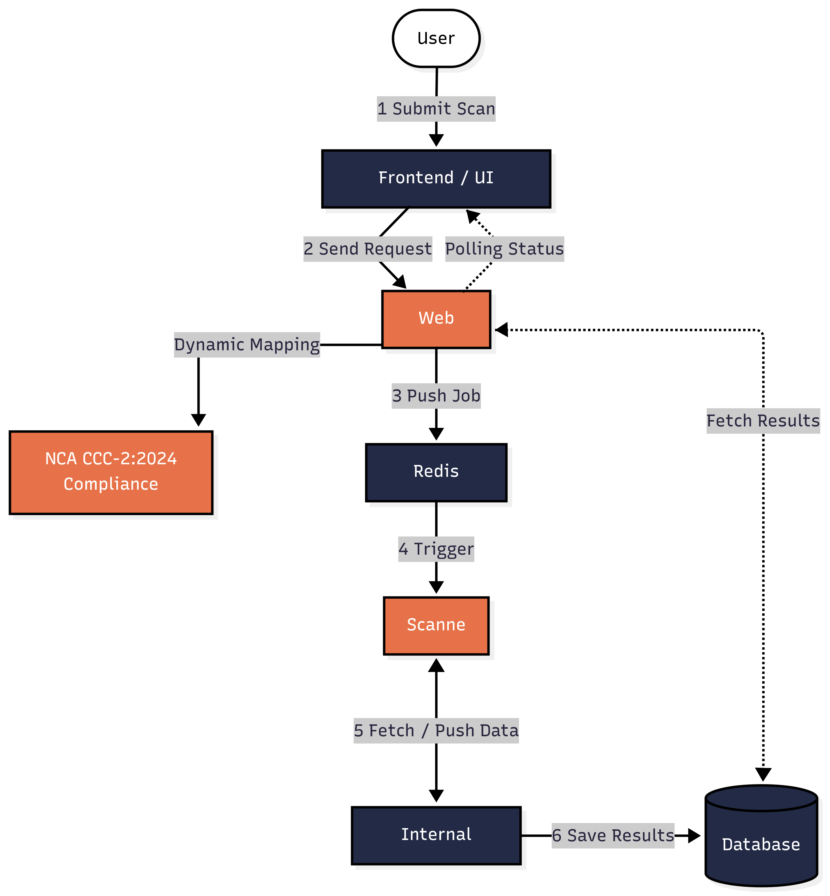
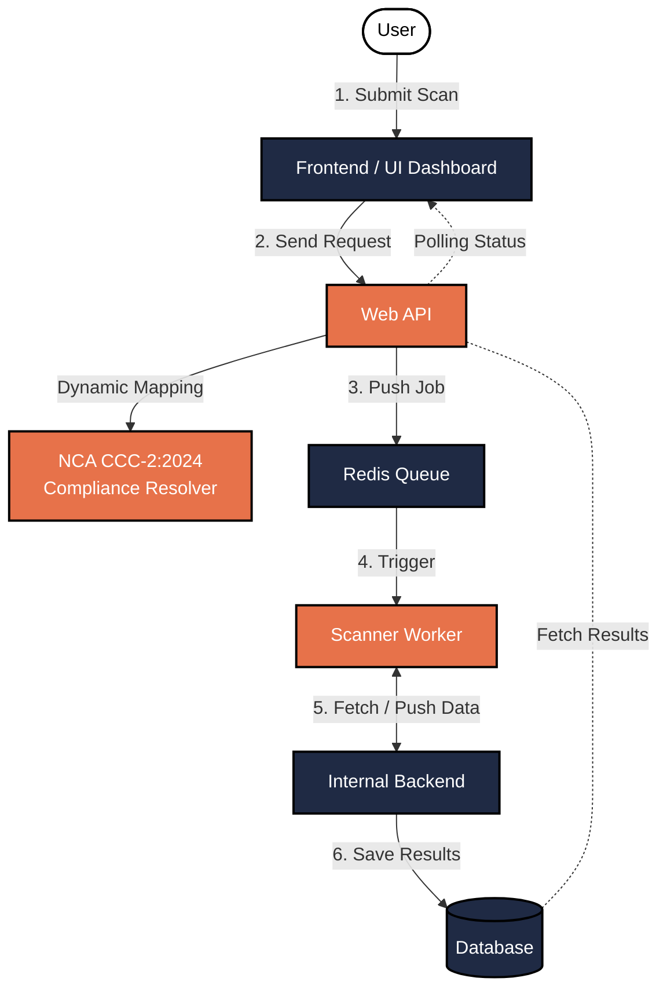

# System Architecture & Network Topology

This document details the multi-tier microservices architecture, network segregation boundaries, and end-to-end data lifecycle of the Sahaba CloudRiskAnalyzer platform.

---

## 1. High-Level Architecture Topology

Sahaba is designed as a decoupled, multi-tier system separating internet-facing customer services from private worker nodes and database infrastructure.





---

## 2. Network Topology & Security Boundaries

Services are partitioned across three distinct Docker bridge networks to enforce least-privilege connectivity:

```
[ Host Ingress ]
  │ :5173              :3000                     :9999            :5432 / :5050
  ▼                    ▼                         ▼                ▼
[ frontend ]         [ web-api ]              [ auth ]      [ db & pgadmin ]
 (React+Vite)      (Express/Prisma)       (Supabase GoTrue) (PostgreSQL 16)
      │                    │                         │                │
      │                    └─────────────────────────┴────────┬───────┘
      │                                                       │
  (web_network)                                         (db_network)
      │                                                       │
      ▼                                                       ▼
[ scanner ] ◄══════════════════════════════════════════ [ internal-backend ]
 (Python Daemon)             (private_network - internal)   (FastAPI/SQLAlchemy)
      ▲                                    ▲
      └────────────── [ redis ] ───────────┘
                    (Message Broker)
```

### Network Definitions

| Network Name | Docker Mode | Connected Services | Purpose |
| :--- | :--- | :--- | :--- |
| **`db_network`** | Bridge (Standard) | `db`, `pgadmin`, `auth`, `web-api`, `internal-backend` | Dedicated database communication and user session management. |
| **`private_network`** | `internal: true` | `web-api`, `internal-backend`, `redis`, `scanner` | Zero-ingress isolated zone for queue operations, job dispatching, and credential decryption. |
| **`web_network`** | Bridge (Standard) | `frontend`, `scanner` | Grants the `scanner` outbound internet egress to call AWS, GCP, and OCI APIs while exposing the UI to users. |

---

## 3. Core Subsystems & Responsibilities

### 3.1 Frontend Web Application (`frontend/`)
- **Technology**: React, Vite, React Router, `@radix-ui/themes`.
- **Function**: Customer-facing single-page application (SPA). Manages cloud connections, initiates manual scans, visualizes infrastructure topology graphs, and renders vulnerability reports.
- **Session Management**: Integrates with Supabase GoTrue via `AuthContext.jsx` and an Axios interceptor client (`apiClient.js`).

### 3.2 Public Web API (`web-api/`)
- **Technology**: Node.js, Express.js, Prisma ORM.
- **Function**: Internet-facing REST API providing user authentication proxies, connection management, scan dispatching, and dynamic compliance resolution.
- **Security**: Encrypts cloud connection credentials using Fernet (AES-128-CBC + HMAC-SHA256) before storing them in PostgreSQL. Pushes job UUIDs to Redis.

### 3.3 Task Queue Broker (`redis`)
- **Technology**: Redis 7 Alpine.
- **Function**: In-memory FIFO queue (`scan_queue`). Implements event-driven job distribution where idle scanner daemons block on `BLPOP`, eliminating polling overhead and achieving 0% idle CPU utilization.

### 3.4 Scanner Worker Daemon (`scanner/`)
- **Technology**: Python 3.11, `boto3`, `google-cloud-*`, `oci`, `requests`.
- **Function**: Decoupled background daemon. Consumes scan jobs from Redis, queries cloud APIs to discover resources, executes the rule evaluation engine, redacts sensitive configuration keys, and submits normalized findings.

### 3.5 Internal Backend (`internal-backend/`)
- **Technology**: Python, FastAPI, SQLAlchemy.
- **Function**: Private microservice in the `private_network`. Authenticates worker requests via `WORKER_API_KEY`, decrypts credentials on demand, performs atomic job locking (`SKIP LOCKED`), maps temporary client resource IDs to PostgreSQL UUIDs, and synchronizes the rule catalog.

### 3.6 Database Layer (`db`)
- **Technology**: PostgreSQL 16 Alpine.
- **Function**: Relational persistence structured under two schemas:
  - `auth`: Managed by Supabase GoTrue for user identities, sessions, and refresh tokens.
  - `public`: Core business tables (`connections`, `scan_jobs`, `resources`, `rules`, `findings`) protected by Row-Level Security (RLS) policies and CHECK constraints.

---

## 4. End-to-End Scan Lifecycle

```
[ User UI ]          [ Web API ]          [ Redis ]          [ Scanner ]          [ Internal Backend ]          [ PostgreSQL ]
     │                    │                   │                   │                        │                         │
     │ 1. POST /scans     │                   │                   │                        │                         │
     ├───────────────────>│                   │                   │                        │                         │
     │                    │ 2. Insert PENDING │                   │                        │                         │
     │                    ├─────────────────────────────────────────────────────────────────────────────────────────>│
     │                    │ 3. RPUSH job_id   │                   │                        │                         │
     │                    ├──────────────────>│                   │                        │                         │
     │                    │                   │ 4. BLPOP job_id   │                        │                         │
     │                    │                   ├──────────────────>│                        │                         │
     │                    │                   │                   │ 5. GET /jobs/{id}      │                         │
     │                    │                   │                   ├───────────────────────>│ 6. Decrypt Credentials  │
     │                    │                   │                   │<───────────────────────┼─────────────────────────┤
     │                    │                   │                   │ 7. Run Cloud Audit     │                         │
     │                    │                   │                   │    (AWS / GCP / OCI)   │                         │
     │                    │                   │                   │ 8. POST /jobs/{id}/res │                         │
     │                    │                   │                   ├───────────────────────>│ 9. Save Resources       │
     │                    │                   │                   │                        │    & Findings           │
     │                    │                   │                   │                        ├────────────────────────>│
     │ 10. GET /results   │                   │                   │                        │                         │
     ├───────────────────>│                   │                   │                        │                         │
     │                    │ 11. Query DB      │                   │                        │                         │
     │                    ├─────────────────────────────────────────────────────────────────────────────────────────>│
     │                    │ 12. Dynamic CCC   │                   │                        │                         │
     │                    │     Resolution    │                   │                        │                         │
     │<───────────────────┤                   │                   │                        │                         │
```

1. **Trigger**: The user initiates a scan against a configured connection via `POST /api/scans`.
2. **Job Enqueue**: The Web API inserts a record with status `PENDING` into `public.scan_jobs` and executes `RPUSH scan_queue <job_id>` on Redis.
3. **Worker Pickup**: An idle Scanner Worker daemon waiting on `BLPOP scan_queue 0` immediately wakes up with the `job_id`.
4. **Credential Negotiation**: The worker issues `GET /internal/jobs/{job_id}` with `Authorization: Bearer <WORKER_API_KEY>` to the Internal Backend. The backend verifies the token, retrieves the connection record, decrypts the Fernet envelope, and returns the credentials payload in memory.
5. **Execution**: The worker calls `POST /internal/jobs/{job_id}/status` with `{"status": "RUNNING"}`, invokes the appropriate cloud provider module, discovers resources, normalizes configurations, redacts secrets, and evaluates security rules.
6. **Results Ingestion**: The worker sends the payload to `POST /internal/jobs/{job_id}/results`. The Internal Backend maps temporary client resource IDs (`res-1`) to database UUIDs, inserts records into `public.resources` and `public.findings`, sets `scan_jobs.status = 'COMPLETED'`, and records `completed_at`.
7. **Compliance Resolution & Presentation**: The user retrieves findings via `GET /api/scans/{scan_id}/results`. The Web API queries findings, joins rule metadata, runs `cccResolver.js` to dynamically map findings to NCA CCC-2:2024 controls based on connection metadata (`CSP`/`CST`, Data Classification Level), and delivers the enriched payload to the Frontend.

---

## 5. Security & Isolation Model

- **Zero Exposure of Cloud Secrets**: Credentials exist only in encrypted form inside PostgreSQL. Decryption happens strictly in-memory within the isolated `private_network`. Decrypted credentials are never returned over public API endpoints.
- **Inter-Service Authentication**: Calls between the scanner workers and the internal backend require a shared `WORKER_API_KEY`.
- **Database Tenant Isolation**: PostgreSQL Row-Level Security (RLS) ensures queries made with a user token can only read and modify records matching their authenticated `user_id`.
