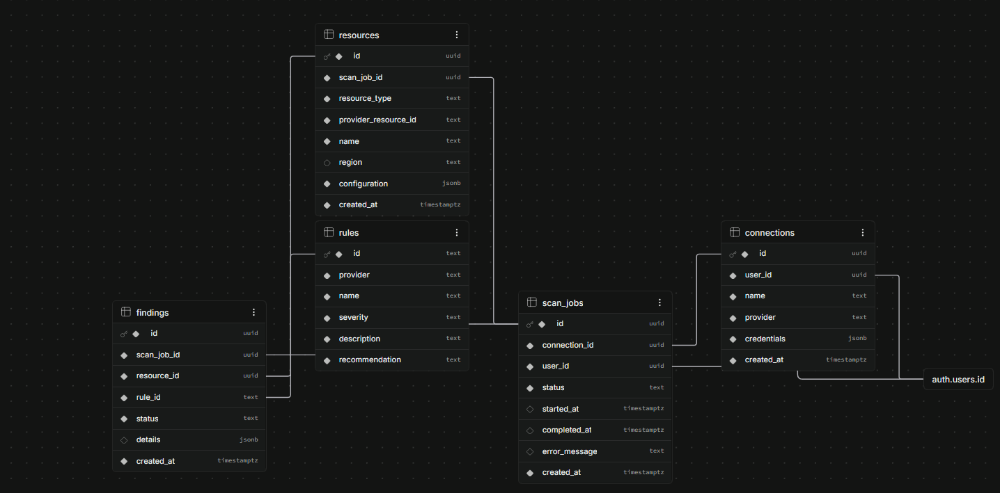

# Cloud Risk Analyzer — Supabase Database Architecture & Schema

This directory contains the database migration scripts, configuration files, and schema documentation for the **Cloud Risk Analyzer** backend powered by [Supabase](https://supabase.com/).

---

## 🖼️ Database Schema & Relationship Overview



---

## 📊 Database Architecture

The database is built on PostgreSQL with Row Level Security (RLS) enabled on all tables. It stores user cloud credentials, manages scan execution workflows, holds resource inventories, catalog security rules, and records security findings.
---

## 🗄️ Table Specifications

### 1. `public.connections`
Stores cloud provider credentials per user.

| Column | Type | Constraints | Description |
| :--- | :--- | :--- | :--- |
| `id` | `UUID` | `PRIMARY KEY`, Default: `gen_random_uuid()` | Unique identifier for connection |
| `user_id` | `UUID` | `NOT NULL`, `REFERENCES auth.users(id) ON DELETE CASCADE` | Owner user ID |
| `name` | `TEXT` | `NOT NULL` | Display name for the connection |
| `provider` | `TEXT` | `NOT NULL`, `CHECK (provider IN ('aws', 'gcp', 'oci'))` | Cloud provider platform |
| `credentials` | `JSONB` | `NOT NULL` | Encrypted/structured cloud credential payload |
| `created_at` | `TIMESTAMPTZ` | `NOT NULL`, Default: `NOW()` | Creation timestamp |

---

### 2. `public.scan_jobs`
Tracks scan execution state and queue management.

| Column | Type | Constraints | Description |
| :--- | :--- | :--- | :--- |
| `id` | `UUID` | `PRIMARY KEY`, Default: `gen_random_uuid()` | Unique scan job identifier |
| `connection_id` | `UUID` | `NOT NULL`, `REFERENCES public.connections(id) ON DELETE CASCADE` | Target cloud connection |
| `user_id` | `UUID` | `NOT NULL`, `REFERENCES auth.users(id) ON DELETE CASCADE` | Job initiator user ID |
| `status` | `TEXT` | `NOT NULL`, Default: `'PENDING'`, `CHECK (status IN ('PENDING', 'RUNNING', 'COMPLETED', 'FAILED'))` | Current execution status |
| `started_at` | `TIMESTAMPTZ` | `NULLABLE` | Timestamp when scan execution began |
| `completed_at` | `TIMESTAMPTZ` | `NULLABLE` | Timestamp when scan execution ended |
| `error_message` | `TEXT` | `NULLABLE` | Execution error details (if failed) |
| `created_at` | `TIMESTAMPTZ` | `NOT NULL`, Default: `NOW()` | Creation timestamp |

---

### 3. `public.resources`
Inventory table holding collected resource configurations.

| Column | Type | Constraints | Description |
| :--- | :--- | :--- | :--- |
| `id` | `UUID` | `PRIMARY KEY`, Default: `gen_random_uuid()` | Unique resource record ID |
| `scan_job_id` | `UUID` | `NOT NULL`, `REFERENCES public.scan_jobs(id) ON DELETE CASCADE` | Associated scan job ID |
| `resource_type` | `TEXT` | `NOT NULL` | Resource type (e.g., `aws_s3_bucket`, `aws_ec2_instance`) |
| `provider_resource_id` | `TEXT` | `NOT NULL` | Cloud provider native resource identifier |
| `name` | `TEXT` | `NOT NULL` | Friendly name or tag |
| `region` | `TEXT` | `NULLABLE` | Cloud region / zone location |
| `configuration` | `JSONB` | `NOT NULL` | Full raw configuration payload |
| `created_at` | `TIMESTAMPTZ` | `NOT NULL`, Default: `NOW()` | Creation timestamp |

---

### 4. `public.rules`
Reference catalog of static security rules.

| Column | Type | Constraints | Description |
| :--- | :--- | :--- | :--- |
| `id` | `TEXT` | `PRIMARY KEY` | Unique rule code (e.g. `SEC-001`, `IAM-001`) |
| `provider` | `TEXT` | `NOT NULL`, `CHECK (provider IN ('aws', 'gcp', 'oci'))` | Target cloud provider |
| `name` | `TEXT` | `NOT NULL` | Concise rule summary |
| `severity` | `TEXT` | `NOT NULL`, `CHECK (severity IN ('CRITICAL', 'HIGH', 'WARNING', 'MEDIUM', 'INFO'))` | Risk severity level |
| `description` | `TEXT` | `NOT NULL` | Detailed explanation of the check |
| `recommendation` | `TEXT` | `NOT NULL` | Actionable remediation guidance |

---

### 5. `public.findings`
Evaluated security check results linking resources to rule outcomes.

| Column | Type | Constraints | Description |
| :--- | :--- | :--- | :--- |
| `id` | `UUID` | `PRIMARY KEY`, Default: `gen_random_uuid()` | Unique finding record ID |
| `scan_job_id` | `UUID` | `NOT NULL`, `REFERENCES public.scan_jobs(id) ON DELETE CASCADE` | Associated scan job |
| `resource_id` | `UUID` | `NOT NULL`, `REFERENCES public.resources(id) ON DELETE CASCADE` | Associated resource record |
| `rule_id` | `TEXT` | `NOT NULL`, `REFERENCES public.rules(id) ON UPDATE CASCADE` | Evaluated rule reference |
| `status` | `TEXT` | `NOT NULL`, `CHECK (status IN ('PASS', 'FAIL'))` | Evaluation result |
| `details` | `JSONB` | `NULLABLE` | Finding metadata, trigger values, context |
| `created_at` | `TIMESTAMPTZ` | `NOT NULL`, Default: `NOW()` | Creation timestamp |

---

## ⚡ Indexes & Performance Optimization

To ensure fast query response times across large scans, the schema includes foreign key performance indexes:

* `idx_connections_user` ➔ `public.connections(user_id)`
* `idx_scan_jobs_connection` ➔ `public.scan_jobs(connection_id)`
* `idx_scan_jobs_user` ➔ `public.scan_jobs(user_id)`
* `idx_resources_scan` ➔ `public.resources(scan_job_id)`
* `idx_findings_scan` ➔ `public.findings(scan_job_id)`
* `idx_findings_resource` ➔ `public.findings(resource_id)`

---

## 🔒 Security Architecture (Row Level Security)

Row Level Security (RLS) is enforced across all tables to guarantee complete data isolation between authenticated users:

1. **`connections`**: Users can only create, view, update, or delete connections where `user_id = auth.uid()`.
2. **`scan_jobs`**: Users can only manage scan jobs where `user_id = auth.uid()`.
3. **`resources`**: Users can only query and insert resources attached to scan jobs that belong to `auth.uid()`.
4. **`findings`**: Users can only query and insert findings linked to scan jobs that belong to `auth.uid()`.
5. **`rules`**: Read-only catalog available to any `authenticated` user.

---

## 🚀 Supabase CLI & Development Workflow

### Prerequisites
* [Node.js](https://nodejs.org/) & `npx`
* Docker Desktop (for local development)

### Common Commands

#### 1. Initialize & Start Local Supabase Stack
```powershell
npx supabase start
```

#### 2. Check Service Status
```powershell
npx supabase status
```

#### 3. Apply Schema Migrations Locally / Remotely
```powershell
# Apply local migration files to local database
npx supabase db reset

# Push local migrations to linked remote database
npx supabase db push
```

#### 4. Create a New Migration File
```powershell
npx supabase migration new <migration_name>
```

#### 5. Link Local Project to Remote Cloud Instance
```powershell
npx supabase link --project-ref <your-project-reference-id>
```

---

## 📁 Directory Structure

```text
supabase/
├── README_Supabase.md         # This documentation file
├── config.toml                # Supabase local CLI configuration
├── db_schema.png              # Database Entity Relationship Diagram preview image
└── migrations/
    └── 20260714000000_init.sql # Database schema, RLS policies, & indexes
```
